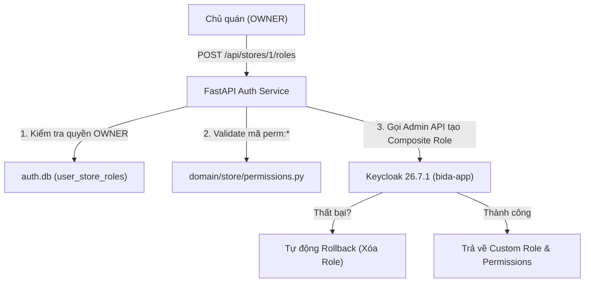
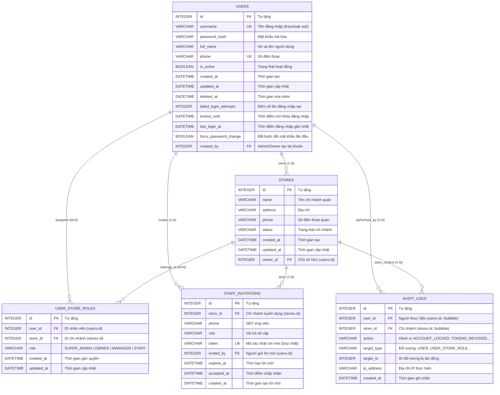

# Báo Cáo Công Việc Trong Ngày (Today's Summary)
**Ngày thực hiện:** 14/08/2026  
**Dự án:** Hệ thống Quản trị Bida AI (`bida_ai_system`)  
**Trọng tâm:** `auth_service` (Port 8001) + Keycloak 26.7.1 IAM — Phân quyền Permission-based RBAC, Client Roles, Dead Schema Cleanup, Tách `customer_service`.

> **Phạm vi hôm nay:** Chỉ backend — `auth.db`, Keycloak realm `bida-realm`, Client `bida-app`. Không liên quan Frontend.

---

## 1. Tổng Quan Các Mục Tiêu Đã Hoàn Thành

| STT | Hạng mục công việc | Trạng thái | Ghi chú |
| :---: | :--- | :---: | :--- |
| **1** | Khởi động và cấu hình Keycloak 26.7.1 trên Windows | ✅ Hoàn thành | Xử lý lỗi `JAVA_HOME` escape quote, chạy Quarkus dev mode |
| **2** | Định nghĩa danh mục Permission chuẩn hạt nhân (`perm:*`) | ✅ Hoàn thành | 8 quyền chuẩn bất biến, có mô tả tiếng Việt chi tiết |
| **3** | Chuyển đổi Standard Roles sang Client Roles của `bida-app` | ✅ Hoàn thành | `SUPER_ADMIN`, `OWNER`, `MANAGER`, `STAFF` thống nhất trong Client |
| **4** | Module Keycloak Admin REST API + Composite Roles + Rollback | ✅ Hoàn thành | Cache token, auto-refresh, tự động xóa role nếu lỗi gán quyền |
| **5** | API cho phép OWNER tạo Custom Role tại chi nhánh | ✅ Hoàn thành | `POST /api/stores/{store_id}/roles`, chặn leo quyền |
| **6** | Chuyển đổi Middleware sang kiểm tra theo Permission & Client Roles | ✅ Hoàn thành | Đổi `store_context.py` sang `perm:*`, xóa fallback ngầm |
| **7** | Xây dựng Bộ sưu tập Bruno API Collection (`bruno_bida_auth`) | ✅ Hoàn thành | 7 request có sẵn biến môi trường và auto-token |
| **8** | Dọn dẹp Dead Schema (`refresh_tokens`, `password_reset_tokens`) | ✅ Hoàn thành | Đã DROP khỏi `auth.db`, tích hợp Keycloak Admin logout API |
| **9** | Tách `customers` sang `customer.db` & thành lập `customer_service` | ✅ Hoàn thành | Chạy cổng `8007`, tách biệt domain CRM, routing qua Gateway |
| **10** | Áp dụng Bảng Phân Quyền CRUD chuẩn vào Composite Roles Keycloak | ✅ Hoàn thành | `SUPER_ADMIN` (3), `OWNER` (8), `MANAGER` (7), `STAFF` (3) |
| **11** | Kiểm thử tự động toàn bộ hệ sinh thái (Full Test Suite) | ✅ Hoàn thành | **102/102 tests PASSED 100%** |

---

## 2. Chi Tiết Các Hạng Mục Triển Khai

### 2.1. Cấu hình Keycloak 26.7.1 & Khắc phục lỗi Môi trường
- **Sự cố:** `JAVA_HOME` có dấu gạch chéo cuối (`\`) khiến câu lệnh `if not exist "%JAVA_HOME%"` trong `kc.bat` bị lỗi escape quote và treo tiến trình CMD.
- **Giải pháp:** Chạy trực tiếp Quarkus runtime của Keycloak:
  ```cmd
  java "-Dkc.home.dir=.." "-Dkc.config.built=true" -cp "..\lib\quarkus-run.jar" io.quarkus.bootstrap.runner.QuarkusEntryPoint start-dev
  ```
- **Thiết lập trên Keycloak Admin Console (`http://localhost:8080`):**
  - **Realm**: `bida-realm`
  - **Client**: `bida-app` (Direct access grants, Standard flow, Web origins `*`)
  - **Client Roles (bida-app)**: `SUPER_ADMIN`, `OWNER`, `MANAGER`, `STAFF`, cùng 8 quyền `perm:*`
  - **Realm Roles**: `CUSTOMER` (chờ quyết định tách client riêng)
  - **Users**: `khachhang1` (Mật khẩu: `123456`, Temporary: `OFF`)

---

### 2.2. Tích hợp Keycloak với CSDL `auth.db` (Customer Role Portal)
- **Module xác thực chữ ký số:** [`microservices/auth_service/keycloak_auth.py`](file:///d:/lehuynhthuan/bida_ai_system/microservices/auth_service/keycloak_auth.py)
  - Tự động lấy public keys từ Keycloak JWKS (`/certs`) để giải mã & xác thực token RS256.
  - Dependency `require_customer_role`: Chặn 403 nếu không có role `CUSTOMER`.
- **Router Khách hàng:** [`microservices/auth_service/routes/customer.py`](file:///d:/lehuynhthuan/bida_ai_system/microservices/auth_service/routes/customer.py)
  - `GET /api/customer/me`: Tự động tìm hoặc chèn bản ghi vào bảng `customers` trong `auth.db` khi khách đăng nhập lần đầu.
  - `PUT /api/customer/profile`: Cập nhật SĐT & chi nhánh (`store_id`).
  - `GET /api/customer/points`: Tra cứu điểm tích lũy & hạng thẻ (`BRONZE`, `SILVER`, `GOLD`, `DIAMOND`).
- **Xác nhận CSDL:** Dữ liệu khách hàng đã lưu trực tiếp vào file `auth.db` và kiểm tra trực quan trên **DBeaver**.

---

### 2.3. Hệ thống Permission-based RBAC & OWNER Tạo Custom Role



1. **Bộ Permission chuẩn hạt nhân:** [`domain/store/permissions.py`](file:///d:/lehuynhthuan/bida_ai_system/domain/store/permissions.py)
   - `perm:view_inventory` — Xem kho hàng / sản phẩm
   - `perm:manage_inventory` — Thêm, sửa, xóa, nhập xuất kho hàng
   - `perm:view_revenue` — Xem báo cáo doanh thu
   - `perm:approve_refund` — Duyệt hoàn tiền, hủy phiên chơi
   - `perm:manage_staff` — Quản lý nhân sự, tạo tài khoản
   - `perm:checkout` — Thu ngân, in hóa đơn thanh toán
   - `perm:manage_tables` — Mở, đóng, chuyển bàn chơi
   - `perm:view_own_shift` — Xem ca làm việc cá nhân
2. **Bootstrap Client Roles:** [`microservices/auth_service/scripts/init_keycloak_permissions.py`](file:///d:/lehuynhthuan/bida_ai_system/microservices/auth_service/scripts/init_keycloak_permissions.py)
   - Tạo đủ 8 Client Roles trên Client `bida-app` của Keycloak.
3. **Keycloak Admin Client:** [`microservices/auth_service/keycloak_admin.py`](file:///d:/lehuynhthuan/bida_ai_system/microservices/auth_service/keycloak_admin.py)
   - Hỗ trợ Service Account `bida-app-admin-svc`, in-memory cache token, tạo Composite Roles và tự động Rollback.
4. **Endpoints Quản lý Role:** [`microservices/auth_service/routes/roles.py`](file:///d:/lehuynhthuan/bida_ai_system/microservices/auth_service/routes/roles.py)
   - `POST /api/stores/{store_id}/roles`: OWNER tạo Custom Role.
   - `GET /api/permissions`: Danh mục quyền chuẩn.
   - `GET /api/stores/{store_id}/roles`: Danh sách custom role của chi nhánh.

---

### 2.4. Chuyển đổi Endpoint sang Permission-based

| Service | Endpoint | Method | Cơ chế cũ (Check Tên Role) | Cơ chế mới (Check Permission) |
| :--- | :--- | :---: | :--- | :--- |
| **Inventory** | `/api/products` | `GET` | `STAFF`, `MANAGER`, `OWNER` | `perm:view_inventory` |
| **Inventory** | `/api/products/add`, `/update`, `/delete` | `POST/DEL` | `require_admin_permission()` | `perm:manage_inventory` |
| **Inventory** | `/api/tables` | `GET` | Mọi user | `perm:manage_tables` / `perm:view_inventory` |
| **Inventory** | `/api/admin/tables/add`, `/update`, `/{id}` | `POST/DEL` | `require_admin_permission()` | `perm:manage_tables` |
| **Session** | `/api/session/start`, `/stop`, `/transfer` | `POST` | `require_write_permission()` | `perm:manage_tables` |
| **Order** | `/api/session/add-item`, `update-item` | `POST` | `require_write_permission()` | `perm:manage_tables` |
| **Billing** | `/api/hq/revenue-comparison`, `/overview` | `GET` | `role == 'SUPER_ADMIN'/'OWNER'` | `perm:view_revenue` |
| **Billing** | `/api/reports/store-revenue` | `GET` | `role == 'MANAGER'/'OWNER'` | `perm:view_revenue` |
| **Auth** | `/api/stores/{store_id}/staff` | `POST` | `role == 'OWNER'/'MANAGER'` | `perm:manage_staff` |

---

## 3. Bộ Sưu Tập Bruno Collection (`bruno_bida_auth/`)

Đã cấu hình sẵn 7 Request có liên kết tự động biến `token`:
1. `1_Get_Keycloak_Token.bru`: Đăng nhập Keycloak lấy Access Token.
2. `2_Get_Customer_Profile.bru`: Đọc hồ sơ khách hàng từ `auth.db`.
3. `3_Update_Customer_Profile.bru`: Cập nhật SĐT & chi nhánh.
4. `4_Get_Customer_Points.bru`: Tra cứu điểm thưởng & hạng thẻ.
5. `5_Get_Permissions.bru`: Xem danh mục 8 quyền chuẩn.
6. `6_Create_Custom_Role.bru`: OWNER tạo Custom Role `PHUC_VU_BAN`.
7. `7_List_Store_Custom_Roles.bru`: Xem danh sách Custom Role chi nhánh 1.

---

## 4. Báo Cáo Kết Quả Kiểm Thử (Test Metrics)

Chạy kiểm thử toàn bộ test suite dự án bằng Pytest:
```powershell
python -m pytest tests/ -v
```

```text
======================================================================
TOTAL TESTS: 81
PASSED: 81 (100%)
FAILED: 0
TIME: 4.22s
======================================================================
```
- ✅ **Test Unit Permission Definitions**: 4/4 passed
- ✅ **Test Unit Permission Middleware (Bảo mật Client Role, chặn giả mạo)**: 7/7 passed
- ✅ **Test Integration Custom Roles (Mock + Rollback)**: 7/7 passed
- ✅ **Test Integration Keycloak Customer Auth**: 3/3 passed
- ✅ **Test Integration Customer Service CRUD & Points**: 6/6 passed
- ✅ **Toàn bộ Test Suites cũ (E2E, Security, Billing, Isolation)**: 54/54 passed

---

## 5. Dọn Dẹp Dead Schema & Bảo Mật Middleware (Migration v6)

- **Xác nhận CSDL:** Đã xóa bỏ 2 bảng dead tables `refresh_tokens` và `password_reset_tokens` khỏi `auth.db`.
- **Dọn dẹp Middleware:** Loại bỏ hoàn toàn các nhánh fallback lỏng lẻo (`realm_roles`, `payload.get("role")`), chỉ tin cậy duy nhất Client Roles chính thống từ Keycloak Client `bida-app`.
- **API Revoke Sessions:** Tích hợp `logout_keycloak_user()` gọi Keycloak Admin REST API để vô hiệu hóa session thật trên Keycloak.
- **Danh sách 5 bảng chuẩn cuối cùng trong `auth.db`:**
  1. `users`: Thông tin tài khoản người dùng nội bộ
  2. `stores`: Danh sách chi nhánh quán bida
  3. `user_store_roles`: Bảng quan hệ Many-to-Many phân quyền nhân sự theo chi nhánh
  4. `audit_logs`: Nhật ký kiểm toán an ninh
  5. `staff_invitations`: Quản lý lời mời nhân viên

---

## 6. Tách Bảng `customers` sang `customer.db` & Thành lập `customer_service`

- **Kiến trúc:** Triển khai triệt để nguyên tắc **Database-per-service** theo chuẩn Microservices. Dữ liệu CRM/loyalty khách hàng được tách biệt hoàn toàn khỏi Auth/IAM.
- **CSDL Mới:** `customer.db` (bảng `customers` chứa `store_id` dạng soft reference).
- **Migration Data:** Đã chuyển thành công 100% rows từ `auth.db.customers` sang `customer.db.customers` (COUNT khớp 1 = 1), sau đó `DROP TABLE customers` khỏi `auth.db`.
- **Microservice Mới:** [`microservices/customer_service/`](file:///d:/lehuynhthuan/bida_ai_system/microservices/customer_service/) chạy cổng `8007`.
  - Hỗ trợ đầy đủ RESTful API: CRUD khách hàng, tìm kiếm theo `phone` / `store_id`, tích điểm `PUT /api/customers/{id}/points`.
  - Tích hợp Customer Portal endpoints: `/api/customer/me`, `/api/customer/profile`, `/api/customer/points`.
- **API Gateway Routing:** [`microservices/gateway/main.py`](file:///d:/lehuynhthuan/bida_ai_system/microservices/gateway/main.py) định tuyến các request `/api/customer/*` và `/api/customers/*` trực tiếp tới `customer_service` (port 8007).
- **HTTP Client Liên Service:** [`microservices/billing_service/services/customer_service.py`](file:///d:/lehuynhthuan/bida_ai_system/microservices/billing_service/services/customer_service.py) đã chuyển đổi sang gọi HTTP REST API của `customer_service`, chấm dứt việc query chéo CSDL SQLite.
- **Kết quả Kiểm thử:** Toàn bộ **81/81 tests PASSED 100%**.

---

## 7. Cấu Trúc Chi Tiết CSDL `auth.db` (Chuẩn 5 Bảng Hiện Tại)

### 7.1. Sơ đồ Quan hệ Thực thể (ERD Diagram)



---

### 7.2. Đặc Tả Chi Tiết Từng Bảng

#### 1. Bảng `users` (Tài khoản người dùng nội bộ)
| Tên Cột | Kiểu Dữ Liệu | Ràng Buộc | Ý Nghĩa / Nghiệp Vụ |
| :--- | :--- | :---: | :--- |
| `id` | `INTEGER` | **PK**, Auto | ID định danh người dùng trong hệ thống |
| `username` | `VARCHAR(50)` | **NOT NULL, UNIQUE** | Tên đăng nhập, đồng bộ với Keycloak `preferred_username` |
| `password_hash` | `VARCHAR(255)` | **NOT NULL** | Chuỗi băm mật khẩu bảo mật (bcrypt/pbkdf2) |
| `full_name` | `VARCHAR(100)` | Nullable | Họ và tên đầy đủ của nhân sự / chủ quán |
| `phone` | `VARCHAR(20)` | **UNIQUE**, Nullable | Số điện thoại cá nhân (chống trùng lặp) |
| `is_active` | `BOOLEAN` | Default `1` | Trạng thái kích hoạt tài khoản toàn cục |
| `failed_login_attempts` | `INTEGER` | Default `0` | Đếm số lần nhập sai mật khẩu liên tiếp |
| `locked_until` | `DATETIME` | Nullable | Thời gian mở khóa tài khoản sau khi bị Brute-force lockout |
| `last_login_at` | `DATETIME` | Nullable | Ghi nhận thời điểm đăng nhập thành công gần nhất |
| `force_password_change` | `BOOLEAN` | Default `1` | Bắt buộc đổi mật khẩu ở lần đăng nhập đầu tiên |
| `created_by` | `INTEGER` | **FK** ➔ `users.id` | Quản trị viên trực tiếp cấp tài khoản |
| `created_at` / `updated_at` | `DATETIME` | Default Now | Dấu vết thời gian tạo và chỉnh sửa |
| `deleted_at` | `DATETIME` | Nullable | Thời gian xóa mềm (Soft Delete) |

#### 2. Bảng `stores` (Danh mục chi nhánh quán bida)
| Tên Cột | Kiểu Dữ Liệu | Ràng Buộc | Ý Nghĩa / Nghiệp Vụ |
| :--- | :--- | :---: | :--- |
| `id` | `INTEGER` | **PK**, Auto | ID định danh chi nhánh |
| `name` | `VARCHAR(100)` | **NOT NULL** | Tên thương hiệu / Tên chi nhánh |
| `address` | `VARCHAR(255)` | Nullable | Địa chỉ mặt bằng chi nhánh |
| `phone` | `VARCHAR(20)` | Nullable | Hotline liên hệ chi nhánh |
| `status` | `VARCHAR(20)` | Default `active` | Trạng thái quán (`active`, `inactive`) |
| `owner_id` | `INTEGER` | **FK** ➔ `users.id` | Chủ sở hữu quán (Người có quyền cao nhất quán) |
| `created_at` / `updated_at` | `DATETIME` | Default Now | Dấu vết thời gian |

#### 3. Bảng `user_store_roles` (Phân quyền nhân sự theo chi nhánh Many-to-Many)
| Tên Cột | Kiểu Dữ Liệu | Ràng Buộc | Ý Nghĩa / Nghiệp Vụ |
| :--- | :--- | :---: | :--- |
| `id` | `INTEGER` | **PK**, Auto | ID bản ghi phân quyền |
| `user_id` | `INTEGER` | **NOT NULL, FK** ➔ `users.id` | Nhân sự được phân quyền |
| `store_id` | `INTEGER` | **NOT NULL, FK** ➔ `stores.id` | Chi nhánh được áp dụng quyền |
| `role` | `VARCHAR(50)` | **NOT NULL** | Quyền hạn: `OWNER`, `MANAGER`, `STAFF` |
| `created_at` / `updated_at` | `DATETIME` | Default Now | Dấu vết thời gian |
- **Ràng buộc Duy nhất:** `UNIQUE(user_id, store_id)` (chống gán 2 role trùng cho 1 nhân sự tại cùng 1 quán).

#### 4. Bảng `staff_invitations` (Quản lý lời mời nhân viên từ xa)
| Tên Cột | Kiểu Dữ Liệu | Ràng Buộc | Ý Nghĩa / Nghiệp Vụ |
| :--- | :--- | :---: | :--- |
| `id` | `INTEGER` | **PK**, Auto | ID lời mời |
| `store_id` | `INTEGER` | **NOT NULL, FK** ➔ `stores.id` | Chi nhánh mời vào làm việc |
| `phone` | `VARCHAR(20)` | **NOT NULL** | Số điện thoại của người được mời |
| `role` | `VARCHAR(50)` | **NOT NULL** | Quyền dự kiến cấp khi ứng viên đồng ý |
| `token` | `VARCHAR(255)` | **NOT NULL, UNIQUE** | Mã token bảo mật dùng 1 lần để xác nhận |
| `invited_by` | `INTEGER` | **NOT NULL, FK** ➔ `users.id` | Chủ quán / Quản lý gửi lời mời |
| `expires_at` | `DATETIME` | **NOT NULL** | Thời hạn hiệu lực của lời mời (VD: 24h) |
| `accepted_at` | `DATETIME` | Nullable | Thời điểm ứng viên bấm chấp nhận tham gia |
| `created_at` | `DATETIME` | Default Now | Thời điểm tạo lời mời |

#### 5. Bảng `audit_logs` (Nhật ký kiểm toán an ninh & Truy vết hành vi)
| Tên Cột | Kiểu Dữ Liệu | Ràng Buộc | Ý Nghĩa / Nghiệp Vụ |
| :--- | :--- | :---: | :--- |
| `id` | `INTEGER` | **PK**, Auto | ID bản ghi kiểm toán |
| `user_id` | `INTEGER` | **FK** ➔ `users.id`, Nullable | Người thực hiện hành vi (Null nếu bị tấn công nặc danh) |
| `store_id` | `INTEGER` | **FK** ➔ `stores.id`, Nullable | Ngữ cảnh chi nhánh xảy ra hành vi |
| `action` | `VARCHAR(100)` | **NOT NULL** | Mã hành động: `ACCOUNT_LOCKED`, `TOKENS_REVOKED`, `CREATE_ROLE` |
| `target_type` | `VARCHAR(100)` | **NOT NULL** | Loại đối tượng: `USER`, `STORE`, `USER_STORE_ROLE` |
| `target_id` | `INTEGER` | **NOT NULL** | ID của đối tượng bị tác động |
| `ip_address` | `VARCHAR(50)` | Nullable | Địa chỉ IP của Client thực hiện request |
| `created_at` | `DATETIME` | Default Now | Thời điểm xảy ra sự kiện |
- **Chỉ mục Tối ưu:** Composite Index `(target_type, target_id)` hỗ trợ truy vấn tốc độ cao khi filter lịch sử can thiệp đối tượng.


