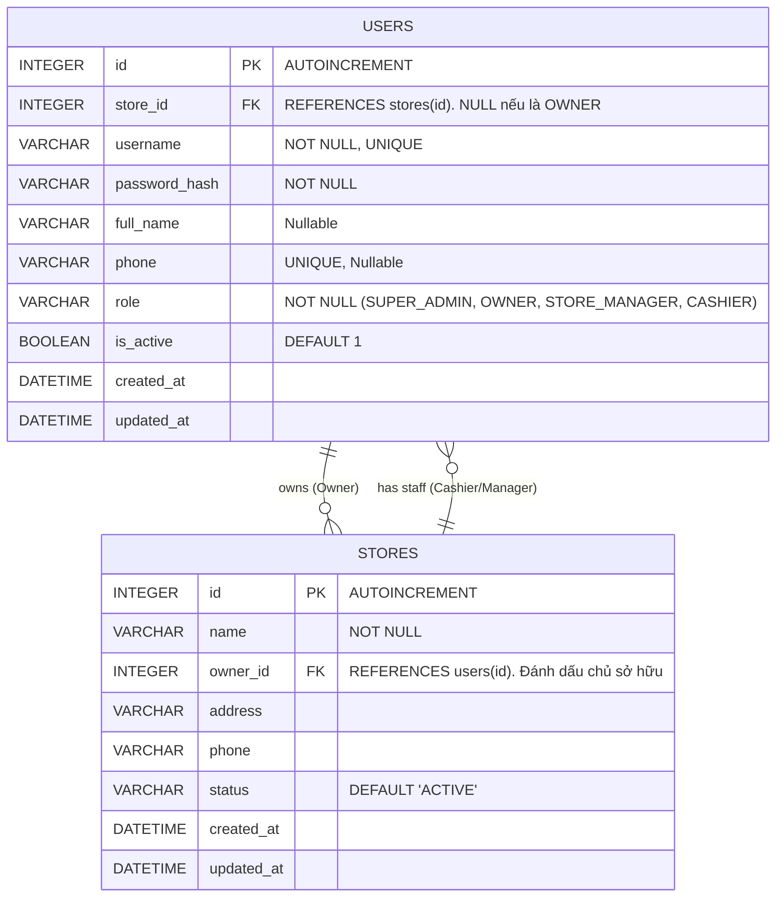

# Kế hoạch Tái cấu trúc CSDL Auth (Auth DB Refactor - 1-N Design)

Tài liệu này là bản đúc kết toàn diện, thống nhất phương án xử lý cơ sở dữ liệu `auth.db` dựa trên thực tiễn nghiệp vụ (Nhân viên làm 1 nơi, Chủ quản lý nhiều nơi). Kế hoạch này chính thức thay thế các bản vẽ N-N (Over-engineering) trước đó.

## 1. Mục tiêu Cấu trúc
- Giữ nguyên cấu trúc 1 User - 1 Store cho Nhân sự (Cashier, Store Manager) để tối giản hệ thống.
- Xử lý bài toán Multi-store cho Chủ chuỗi (OWNER) thông qua cột `owner_id` của bảng `stores`.
- Tuyệt đối không dùng bảng trung gian N-N.

## 2. Sơ đồ Cơ sở Dữ liệu (ER Diagram)

Dưới đây là sơ đồ tương tác chính xác sau khi Refactor:

## 3. Các bước Di cư (Database Migration)
Vì hiện tại DB đang vướng bảng N-N cũ, kịch bản Rollback DB sẽ như sau:

**SQL Script (auth_rollback_v4.py):**
1. **Khôi phục Cột:** Trả lại cột `store_id` và `role` cho bảng `users`.
2. **Khôi phục Dữ liệu:** Hút dữ liệu từ `user_store_roles` đắp ngược lại vào bảng `users`.
3. **Tiêu hủy Bảng thừa:** DROP bảng `user_store_roles`.
4. **Tối ưu Index:** Khởi tạo lại `UNIQUE INDEX` cho `phone` và `username`.

## 4. Cải tiến Middleware & JWT (Backend Refactor)
Làm sao để Microservices biết Chủ chuỗi có quyền vào các chi nhánh nào mà không cần truy vấn DB?

**Giải pháp: Nhồi danh sách cửa hàng sở hữu vào JWT.**
- Khi User đăng nhập, nếu role là `OWNER`:
  Auth Service sẽ query bảng `stores` tìm tất cả các cửa hàng có `owner_id == user.id`.
  Ví dụ, Chủ chuỗi có ID=5 sở hữu Store 1 và Store 2, JWT sinh ra sẽ là:
  `{"user_id": 5, "role": "OWNER", "owned_store_ids": [1, 2]}`
- Các role khác (Nhân viên):
  `{"user_id": 6, "role": "CASHIER", "store_id": 1}`

**Luồng Middleware (`store_context.py`):**
- Bắt buộc Frontend gửi Header `X-Target-Store: <store_id>`.
- Nếu role là `OWNER`, kiểm tra `X-Target-Store` có nằm trong mảng `owned_store_ids` của JWT hay không.
- Nếu role là Nhân viên, kiểm tra `X-Target-Store == store_id` của JWT hay không.

## 5. Danh sách Hành động (Checklist)
- [ ] Chạy script Rollback Database (`auth.db`).
- [ ] Cập nhật Model `user.py` (Xóa model cũ).
- [ ] Refactor API Login trong Auth Service.
- [ ] Cập nhật Middleware `store_context.py` cho tất cả Microservices.
- [ ] Dọn dẹp rác Hardcode Role (`ADMIN` -> `OWNER`, `MANAGER` -> `STORE_MANAGER`) trên toàn hệ thống bằng Regex.

---
**Đây là chốt chặn cuối cùng. Nếu sếp đã hoàn toàn hài lòng với thiết kế (Schema) và Kế hoạch thực thi (Checklist) này, xin mời sếp bấm "Proceed" để em bung lụa gõ code!**
