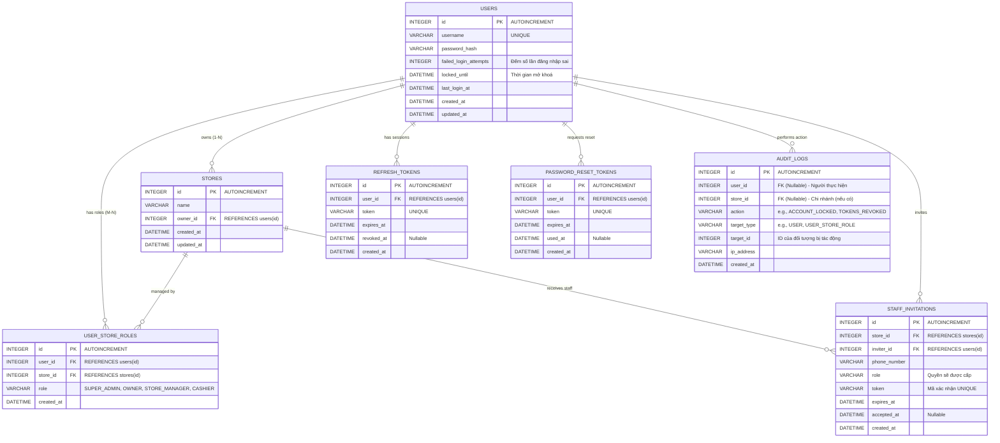

# Kế hoạch Tái cấu trúc CSDL Auth (Auth DB Refactor Plan)

Tài liệu này mô tả chi tiết kiến trúc của cơ sở dữ liệu `auth.db` (database-per-service SQLite), tập trung vào thiết kế Many-to-Many (M-N) cho hệ thống đa chi nhánh và tích hợp các lớp bảo mật. Tài liệu dành cho team kỹ thuật tham khảo và điều chỉnh.

## 1. Mục tiêu Tái cấu trúc (Refactoring Goals)

1.  **Phục hồi cấu trúc Many-to-Many:** Tách `store_id` và `role` ra khỏi bảng `users`, trả về bảng trung gian `user_store_roles` để cho phép 1 nhân sự làm việc tại nhiều chi nhánh với các role khác nhau.
2.  **Tích hợp Cơ chế Bảo mật (Security Context):**
    *   **Brute-force protection:** Đếm số lần đăng nhập sai và khoá tài khoản (cột `failed_login_attempts`, `locked_until` trong `users`).
    *   **Audit Logging:** Truy vết hành động nhạy cảm của người dùng (bảng `audit_logs`).
    *   **Token Management:** Quản lý vòng đời Refresh Token và Token Đổi mật khẩu (bảng `refresh_tokens`, `password_reset_tokens`).
    *   **Staff Onboarding:** Quản lý quy trình mời nhân viên vào chi nhánh (bảng `staff_invitations`).

## 2. Sơ đồ Cơ sở dữ liệu (ER Diagram)

## 3. Checklist & Lưu ý Kỹ thuật (Technical Constraints)

1.  **Ràng buộc Dữ liệu (Constraints):**
    *   **`user_store_roles`:** Bắt buộc áp dụng `UniqueConstraint('user_id', 'store_id')` trong SQLAlchemy để chống trùng lặp quyền tại một chi nhánh.
2.  **Chỉ mục (Indexes):**
    *   **`audit_logs`:** Bổ sung Composite Index trên `(target_type, target_id)` hoặc Index trên `user_id` để tối ưu truy vấn khi cần filter lịch sử.
3.  **Migration (SQLite & Alembic):**
    *   Sử dụng Batch Operations (`with op.batch_alter_table(...)`) vì SQLite không hỗ trợ DROP/ALTER COLUMN trực tiếp.
    *   Đảm bảo Script down-migration xử lý rollback dữ liệu đầy đủ.
