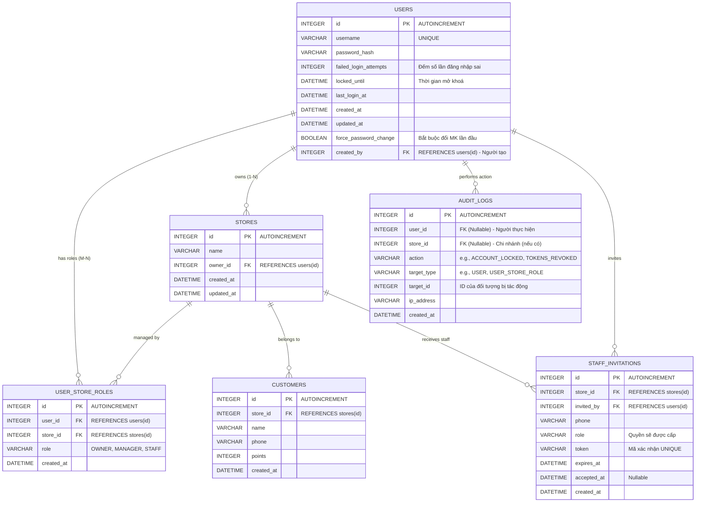

# Kế hoạch Tái cấu trúc CSDL Auth (Auth DB Refactor Plan)

Tài liệu này mô tả chi tiết kiến trúc của cơ sở dữ liệu `auth.db` (database-per-service SQLite), tập trung vào thiết kế Many-to-Many (M-N) cho hệ thống đa chi nhánh và tích hợp các lớp bảo mật. Tài liệu dành cho team kỹ thuật tham khảo và điều chỉnh.

## 1. Mục tiêu Tái cấu trúc (Refactoring Goals)

1.  **Phục hồi cấu trúc Many-to-Many:** Tách `store_id` và `role` ra khỏi bảng `users`, trả về bảng trung gian `user_store_roles` để cho phép 1 nhân sự làm việc tại nhiều chi nhánh với các role khác nhau.
2.  **Tích hợp Cơ chế Bảo mật (Security Context):**
    *   **Brute-force protection:** Đếm số lần đăng nhập sai và khoá tài khoản (cột `failed_login_attempts`, `locked_until` trong `users`).
    *   **Audit Logging:** Truy vết hành động nhạy cảm của người dùng (bảng `audit_logs`).
    *   **Token Management:** Quản lý vòng đời Token (Access/Refresh Token, Password Reset) được ủy thác hoàn toàn cho **Keycloak IAM** đảm nhiệm. Loại bỏ dead tables `refresh_tokens` và `password_reset_tokens` khỏi `auth.db`.
    *   **Staff Creation (Luồng chính):** Admin trực tiếp tạo tài khoản nhân viên mới (`users`), bắt buộc nhân viên đổi mật khẩu ở lần đăng nhập đầu tiên (`force_password_change`).
    *   **Staff Invitations (Luồng dự phòng):** Hỗ trợ mời nhân viên tham gia (ví dụ: nhân sự làm từ xa) thông qua bảng `staff_invitations`. Luồng này được giữ lại để sử dụng trong các tình huống đặc biệt, không phải luồng mặc định.

## 2. Sơ đồ Cơ sở dữ liệu Chuẩn (ER Diagram - 6 Tables)

## 3. Checklist & Lưu ý Kỹ thuật (Technical Constraints)

1.  **Ràng buộc Dữ liệu (Constraints):**
    *   **`user_store_roles`:** Bắt buộc áp dụng `UniqueConstraint('user_id', 'store_id')` trong SQLAlchemy để chống trùng lặp quyền tại một chi nhánh.
2.  **Chỉ mục (Indexes):**
    *   **`audit_logs`:** Bổ sung Composite Index trên `(target_type, target_id)` hoặc Index trên `user_id` để tối ưu truy vấn khi cần filter lịch sử.
3.  **Migration (SQLite & Alembic):**
    *   Sử dụng Batch Operations (`with op.batch_alter_table(...)`) vì SQLite không hỗ trợ DROP/ALTER COLUMN trực tiếp.
    *   Đảm bảo Script down-migration xử lý rollback dữ liệu đầy đủ.

## 4. Nhật ký thay đổi mới nhất (Today's Updates)

Trong lần refactor CSDL cuối cùng (Final Schema Design), các hành động sau đã được thực thi và xác nhận trên DB thực tế (`auth.db`):

1. **Chuẩn hoá Roles (100% Pass):** Xóa sổ các role cũ dư thừa/lộn xộn (`ADMIN`, `STORE_MANAGER`, `CASHIER`). Ép hệ thống dùng bộ 4 role duy nhất: `SUPER_ADMIN`, `OWNER`, `MANAGER`, `STAFF`.
2. **Luồng tạo Nhân viên Chính thức:** Đưa cờ `force_password_change` và `created_by` vào bảng `users` nhằm đáp ứng yêu cầu Admin cấp thẳng tài khoản cho nhân viên thay vì bắt họ đăng ký. 
3. **Database Constraints Level:**
   - Chạy Migration ép cứng **CHECK Constraint** bằng SQLite trên bảng `user_store_roles` và `staff_invitations` nhằm từ chối mọi lệnh Insert/Update nếu chuỗi Role nằm ngoài danh sách cho phép. (VD: Cấm nhét `SUPER_ADMIN` vào `user_store_roles` vì trụ sở Máy Mẹ không phụ thuộc bất kỳ chi nhánh nào).
   - Thiết lập **Unique Index** chống chọc lủng cho `token` ở `staff_invitations`.
   - Thiết lập **Composite Index** trên `(target_type, target_id)` ở `audit_logs` để tăng tốc truy vấn.
4. **Data Isolation (Cách ly dữ liệu):** Sửa lỗi định danh Token ở toàn bộ Microservices (Inventory, Order, Billing) để tuân thủ Role Context mới, chống lại các hành vi tấn công vượt quyền (IDOR / Privilege Escalation) bằng Token hết hạn hoặc sai Role.
5. **Full Test Suite:** 100% (45/45 tests) Unit Test, Security Test và Integration Test đã Passed trên mô hình Schema mới này.
