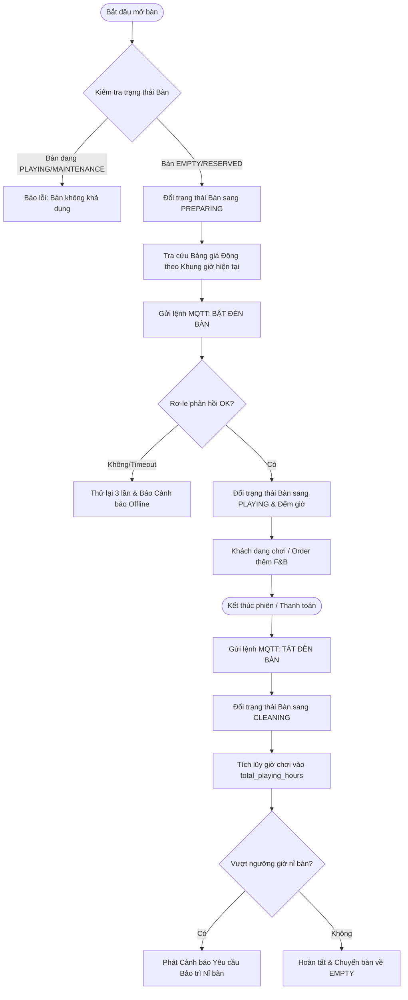
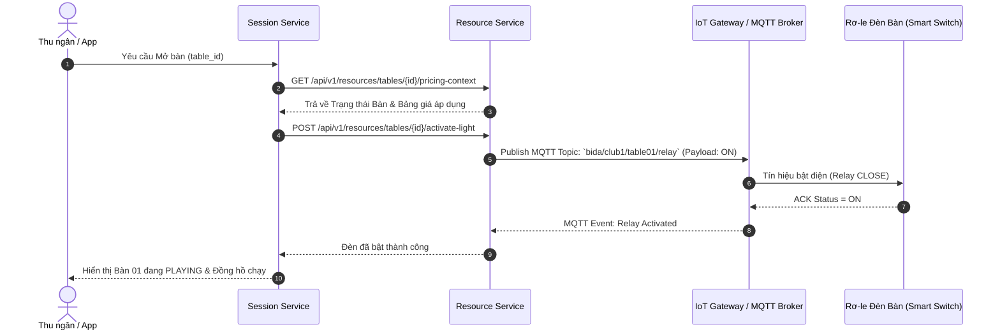

# TÀI LIỆU PHÂN TÍCH NGHIỆP VỤ (BA SPECIFICATION) - RESOURCE SERVICE
*Chuẩn hóa theo BA System Prompt Standard (v1.0)*

---

## BƯỚC 1: TIẾP NHẬN & TÓM TẮT YÊU CẦU (EXECUTIVE SUMMARY & ELICITATION)

### 1.1 Tóm tắt bài toán (Executive Summary)
**Resource Service** đóng vai trò là "Trái tim vận hành vật lý" (Physical Operational Engine) của chuỗi Club Bida CueOS. Hệ thống chịu trách nhiệm:
1. **Quản lý Bàn bida & Phân vùng (Smart Table & Zone Management)**: Tích hợp công tắc thông minh IoT Rơ-le tự động bật/tắt đèn bàn theo phiên chơi, kết nối luồng Camera AI.
2. **Động cơ Bảng giá động (Dynamic Pricing Engine Matrix)**: Áp giá giờ chơi chính xác theo giây/phút dựa trên Loại bàn × Khung giờ trong ngày × Ngày trong tuần / Ngày lễ.
3. **Quản lý Vật tư, Cơ, Bi & Tiêu hao (Accessories & Consumables)**: Gán tài sản theo bàn (bi, cơ), quản lý cơ VIP cho thuê và vật tư tiêu hao (lơ, găng tay).
4. **Quản lý Kho F&B & Quy đổi Đơn vị tính (Multi-Unit Inventory & BOM)**: Tự động quy đổi Thùng/Két ➔ Lon/Chai, trừ kho nguyên liệu pha chế.
5. **Vòng đời Bảo trì & Khấu hao Tài sản (Asset Maintenance Lifecycle)**: Tích lũy giờ chơi thực tế để phát cảnh báo tự động thay nỉ bàn, canh lăng, bảo dưỡng thiết bị.

---

### 1.2 Câu hỏi Clarification dành cho Stakeholders (Elicitation Questions)
*(Đưa ra 4 câu hỏi trọng tâm để tiếp tục làm rõ nếu khách hàng có yêu cầu đặc thù):*
1. **Business Goals**: Khi khách chơi quá giờ đóng cửa mặc định của Club, hệ thống sẽ tự động tắt đèn bàn hay tiếp tục đếm giờ và áp giá Late-Night?
2. **User Persona**: Thu ngân có được phép tự ghi đè (Override) giá giờ chơi hoặc tự bật đèn bàn thủ công không cần mở phiên chơi (Manual Override)?
3. **System Boundaries**: Khi mất kết nối Internet/WiFi tại Club, Rơ-le IoT có cơ chế lưu trạng thái Offline (Offline State Persistence) để giữ đèn sáng hay không?
4. **Data/Logic**: Quy tắc rounding (làm tròn) giá giờ chơi sẽ tính theo block 1 phút, 5 phút, hay 15 phút sau block đầu tiên?

---

## BƯỚC 2: PHÂN TÍCH QUY TRÌNH & LUỒNG XỬ LÝ (PROCESS MODELING)

### 2.1 Sơ đồ GAP Analysis (So sánh Quy trình As-Is vs To-Be)

| Hạng mục | Quy trình Hiện tại (As-Is - Thủ công) | Quy trình Tương lai (To-Be - CueOS System) | Khoảng trống (Gap) | Giải pháp đề xuất | Mức độ ưu tiên |
| :--- | :--- | :--- | :--- | :--- | :--- |
| **Bật/tắt đèn bàn** | Thu ngân bật công tắc cơ bằng tay hoặc ghi sổ thủ công. | Hệ thống phát tín hiệu MQTT tới Rơ-le IoT tự động bật/tắt đèn. | Gian lận bật đèn chui không qua phần mềm. | Tích hợp **Resource Service IoT Controller**. | **High (P0)** |
| **Tính giá bida** | Nhìn đồng hồ bấm tay, tra bảng giá giấy, tự tính tiền. | **Dynamic Pricing Engine** tự tính từng phút theo khung giờ. | Tính sai giá giờ cao điểm/chuyển giao ca. | Thuật toán tính giá phân mảnh theo khung giờ real-time. | **High (P0)** |
| **Quản lý kho F&B** | Kiểm kho thủ công cuối ngày, lệch số lượng lon/thùng. | Quy đổi đơn vị tự động (Thùng ➔ Lon) & Trừ kho pha chế BOM. | Lệch kho do bán lẻ từ thùng nhập. | Bảng quy đổi đơn vị tính `conversion_rate` & `BOM`. | **Medium (P1)** |
| **Bảo trì nỉ bàn** | Chờ nỉ rách hoặc khách phàn nàn mới thay nỉ. | Tích lũy `total_playing_hours` tự động phát cảnh báo khi đạt ngưỡng. | Giảm trải nghiệm khách hàng do nỉ cũ. | Auto-Alert Maintenance Scheduler. | **Medium (P1)** |

---

### 2.2 Sơ đồ Luồng Nghiệp vụ tổng thể (Flowchart To-Be Process)

---

### 2.3 Sơ đồ Tuần tự Kích hoạt IoT Bật đèn (Sequence Diagram)

---

## BƯỚC 3: ĐÓNG GÓI YÊU CẦU (DOCUMENTATION & USER STORIES)

### 3.1 [US-RES-01] Tự động bật/tắt đèn bàn bida qua Rơ-le IoT

**Người thực hiện (Persona):** Thu ngân / Nhân viên phục vụ  
**Hành động (Action):** Mở phiên chơi cho bàn bida trên phần mềm  
**Mục đích (Benefit):** Hệ thống tự động bật đèn bàn bida, chống gian lận bật đèn chui và chính xác hóa thời gian chơi  

---

#### 1. Điều kiện tiên quyết (Pre-conditions)
* Bàn bida đang ở trạng thái `EMPTY` hoặc `RESERVED`.
* Rơ-le IoT điều khiển đèn bàn đang kết nối mạng (Ping OK).

#### 2. Kịch bản nghiệm thu (Acceptance Criteria - Gherkin Format)

##### Kịch bản 1: [Luồng chính] Mở bàn thành công và đèn sáng ngay lập tức
* **Given (Giả sử):** Bàn "Bàn 01" đang ở trạng thái `EMPTY` và Rơ-le `RELAY-01` hoạt động bình thường.
* **When (Khi):** Thu ngân nhấn nút "Mở bàn" trên màn hình quản lý.
* **Then (Thì):** Trạng thái bàn chuyển sang `PLAYING`, phần mềm gửi lệnh MQTT `ON` tới `RELAY-01`, đèn Bàn 01 sáng trong vòng `< 1 giây`, và đồng hồ bắt đầu tính giờ.

##### Kịch bản 2: [Luồng ngoại lệ] Rơ-le IoT bị mất kết nối (Offline)
* **Given (Giả sử):** Rơ-le `RELAY-01` bị rút phích cắm hoặc mất mạng WiFi.
* **When (Khi):** Thu ngân nhấn "Mở bàn".
* **Then (Thì):** Hệ thống thử lại 3 lần (trong 3 giây). Sau 3 giây không nhận ACK, hệ thống hiển thị thông báo: *"Cảnh báo: Không thể bật đèn tự động cho Bàn 01. Vui lòng kiểm tra Rơ-le IoT hoặc bật công tắc dự phòng!"*, đồng thời ghi nhật ký lỗi (Error Log).

#### 3. Quy tắc Nghiệp vụ (Business Rules)
* **BR-RES-01:** Đèn bàn chỉ được phép bật khi có phiên chơi hợp lệ (`status = PLAYING`).
* **BR-RES-02:** Khi kết thúc phiên chơi hoặc hủy phiên, đèn phải tự động tắt ngay lập tức.
* **BR-RES-03:** Sau khi tắt đèn, bàn bắt buộc chuyển qua trạng thái trung gian `CLEANING` trong tối thiểu 3 phút trước khi trở lại `EMPTY`.

#### 4. Danh mục Dữ liệu (Data Dictionary / Fields)
| Tên trường | Kiểu dữ liệu | Bắt buộc | Quy tắc kiểm tra (Validation) |
| :--- | :--- | :--- | :--- |
| `table_id` | Integer | Có | Tồn tại trong bảng `tables` |
| `iot_device_id` | String | Có | Định dạng MQTT Topic hợp lệ (`bida/{club}/{table}/relay`) |
| `current_status` | String | Có | Một trong: `EMPTY`, `PREPARING`, `PLAYING`, `PAUSED`, `CLEANING`, `MAINTENANCE` |

#### 5. Kịch bản biên & Rủi ro (Edge Cases)
* Mất mạng Internet toàn Club khi bàn đang `PLAYING` ➔ Đèn vẫn duy trì trạng thái sáng; khi có mạng lại, hệ thống đồng bộ lại thời điểm kết thúc.

---

### 3.2 [US-RES-02] Tính giá giờ chơi linh hoạt theo Bảng giá động (Dynamic Pricing Engine)

**Người thực hiện (Persona):** Khách hàng / Thu ngân  
**Hành động (Action):** Chơi bida xuyên qua các khung giờ trong ngày (ví dụ: từ 17:00 đến 19:30)  
**Mục đích (Benefit):** Hệ thống tự động tách nhỏ các khoảng thời gian và áp đúng đơn giá từng khung giờ, đảm bảo tính tiền công bằng và tối ưu doanh thu  

---

#### 1. Kịch bản nghiệm thu (Acceptance Criteria - Gherkin Format)

##### Kịch bản 1: Tính giá chuyển khung giờ từ Giờ Thường sang Giờ Vàng (Peak Hour)
* **Given (Giả sử):** Bảng giá Bàn Standard quy định:
  - Khung 14:00 - 18:00: `60.000 VNĐ/giờ` (1.000đ/phút).
  - Khung 18:00 - 23:00: `90.000 VNĐ/giờ` (1.500đ/phút).
* **When (Khi):** Khách mở bàn lúc 17:00 và kết thúc phiên lúc 19:00 (Tổng thời gian 120 phút).
* **Then (Thì):** Hệ thống tự động chia làm 2 mốc tính tiền:
  - Mốc 1 (17:00 - 18:00 = 60 phút): `60 phút × 1.000đ = 60.000 VNĐ`.
  - Mốc 2 (18:00 - 19:00 = 60 phút): `60 phút × 1.500đ = 90.000 VNĐ`.
  - Tổng tiền giờ = `150.000 VNĐ`.

#### 2. Quy tắc Nghiệp vụ (Business Rules)
* **BR-RES-04 (Minimum Block):** Phiên chơi dưới 15 phút được làm tròn thành 15 phút.
* **BR-RES-05 (Rounding Rule):** Sau 15 phút đầu, tiền giờ tính chính xác theo từng phút thực tế (`hourly_rate / 60`).

---

### 3.3 [US-RES-03] Quản lý xuất/nhập kho F&B với Quy đổi đơn vị tính (Multi-Unit Conversion)

**Người thực hiện (Persona):** Quản lý kho / Thu ngân  
**Hành động (Action):** Nhập kho theo đơn vị Thùng/Két và bán lẻ theo Lon/Chai  
**Mục đích (Benefit):** Quản lý chính xác tồn kho đến từng lon nước, loại bỏ sai lệch số liệu  

---

#### 1. Kịch bản nghiệm thu (Acceptance Criteria - Gherkin Format)

##### Kịch bản 1: Quy đổi tự động khi nhập kho Thùng
* **Given (Giả sử):** Sản phẩm "Bia Heineken" có `import_unit = Thùng`, `base_unit = Lon`, `conversion_rate = 24`. Tồn kho hiện tại là `0 Lon`.
* **When (Khi):** Quản lý kho tạo phiếu Nhập kho `10 Thùng`.
* **Then (Thì):** Hệ thống tự động cập nhật số lượng tồn kho khả dụng bán lẻ = `10 × 24 = 240 Lon`.

---

### 3.4 [US-RES-04] Cảnh báo bảo trì nỉ bàn tự động theo giờ chơi tích lũy

**Người thực hiện (Persona):** Quản lý Club / Kỹ thuật viên  
**Hành động (Action):** Theo dõi chất lượng bàn bida trên Dashboard  
**Mục đích (Benefit):** Nhận cảnh báo tự động khi nỉ bàn đạt giới hạn giờ chơi để chủ động bọc lại nỉ, giữ trải nghiệm chơi tốt nhất  

---

#### 1. Kịch bản nghiệm thu (Acceptance Criteria - Gherkin Format)

##### Kịch bản 1: Tự động phát cảnh báo khi vượt ngưỡng giờ chơi
* **Given (Giả sử):** Bàn Bàn 02 có `maintenance_threshold_hours = 300.0` giờ và `total_playing_hours = 298.0` giờ.
* **When (Khi):** Bàn 02 kết thúc một phiên chơi dài `3.0` giờ (Tổng giờ tích lũy mới = `301.0` giờ).
* **Then (Thì):** Hệ thống tự động gắn nhãn `MAINTENANCE_REQUIRED` cho Bàn 02 và gửi thông báo cảnh báo lên màn hình Quản lý: *"Bàn 02 đã đạt 301/300 giờ chơi. Vui lòng lên lịch thay vải nỉ!"*.

---

## BƯỚC 4: ĐÁNH GIÁ RỦI RO & CHECKLIST NGHIỆM THỨC (RISKS & UAT CHECKLIST)

### 4.1 Danh sách Kịch bản biên & Rủi ro hệ thống (Edge Cases & Risks)

| STT | Kịch bản biên / Sự cố | Đánh giá rủi ro | Giải pháp kỹ thuật xử lý |
|---|---|---|---|
| **1** | **Xung đột sửa giá khi bàn đang PLAYING** | Quản lý sửa đơn giá giờ chơi trong lúc khách đang chơi. | Áp dụng quy tắc **Price Locking**: Giá giờ chơi của phiên được chốt tại thời điểm mở bàn, không bị ảnh hưởng bởi thay đổi giá sau đó. |
| **2** | **Bán F&B đồng thời (Race Condition)** | 2 thu ngân cùng bán lon nước cuối cùng trong kho. | Sử dụng **Database Transaction & Pessimistic Locking** (`SELECT FOR UPDATE`) khi trừ kho sản phẩm. |
| **3** | **Đèn bật nhưng Rơ-le hỏng không tắt được** | Đèn bàn sáng liên tục gây lãng phí điện năng. | Hệ thống gửi cảnh báo **Hardware Timeout Alert** sau 10 giây không có tín hiệu tắt. |

---

### 4.2 Checklist Nghiệm thu Chấp nhận Người dùng (UAT Checklist cho QA/Client)

- [ ] **Test UAT-01**: Mở bàn trên giao diện phần mềm ➔ Rơ-le IoT phản hồi bật đèn bàn trong `< 1 giây`.
- [ ] **Test UAT-02**: Kết thúc phiên chơi ➔ Đèn tự động tắt ngay lập tức & Bàn chuyển sang trạng thái `CLEANING`.
- [ ] **Test UAT-03**: Khách chơi xuyên khung giờ 17:30 - 18:30 ➔ Hệ thống tính đúng tiền tách làm 2 mức giá khác nhau.
- [ ] **Test UAT-04**: Nhập 1 Thùng bia 24 lon ➔ Số lượng khả dụng trên màn hình thu ngân tăng đúng 24 lon.
- [ ] **Test UAT-05**: Bán 1 Ly cà phê pha chế (BOM) ➔ Kho nguyên liệu hạt cà phê và sữa đặc bị trừ đúng tỷ lệ.
- [ ] **Test UAT-06**: Giờ chơi tích lũy vượt ngưỡng `maintenance_threshold_hours` ➔ Cảnh báo thay nỉ bàn hiển thị trên Dashboard Quản lý.
- [ ] **Test UAT-07**: Tắt kết nối Internet của Rơ-le ➔ Màn hình hiển thị đúng cảnh báo Rơ-le Offline và cho phép ghi đè thủ công.

---
*Nội dung đã được chuẩn hóa và cập nhật trực tiếp vào file tài liệu [resource_service_design.md](file:///c:/Users/Tan/.gemini/antigravity-ide/scratch/cueos-backend/resource_service_design.md).*
